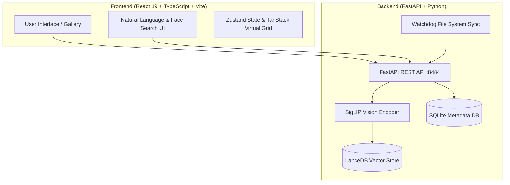

# ✦ Memoir

<p align="center">
  <strong>Local-First, Privacy-First AI Photo Management & Semantic Search</strong>
</p>

<p align="center">
  <a href="#key-features">Key Features</a> •
  <a href="#system-architecture">Architecture</a> •
  <a href="#tech-stack">Tech Stack</a> •
  <a href="#getting-started">Getting Started</a> •
  <a href="#configuration">Configuration</a> •
  <a href="#api-reference">API Reference</a>
</p>

---

## 📸 Overview

**Memoir** is an open-source, local-first photo management application designed to organize, search, and relive your memories with zero compromise on privacy. 

Unlike cloud photo services, Memoir processes everything locally on your machine. Using state-of-the-art vision models (**SigLIP**) and local vector storage (**LanceDB**), Memoir enables deep semantic natural language search across your photo library—without sending a single byte to the cloud.

> **Privacy Guarantee**: No cloud API calls. No analytics. No telemetry. No ads. Your memories stay strictly on your device.

---

## ✨ Key Features

- 🔍 **Semantic Natural Language Search**: Search for photos using descriptive phrases like *"sunset over snowy mountains"*, *"dog playing with ball in grass"*, or *"coffee on wooden table"*. Powered by SigLIP visual embeddings.
- 🔒 **100% Local & Offline**: All indexing, vector generation, database operations, and thumbnail generation run locally on your system.
- 👤 **Face Recognition & People Tagging**: Automatically detects faces, groups recurring individuals, and allows personalized name tagging.
- ✈️ **Smart Trips & Location Highlights**: Intelligent spatial and temporal clustering groups your photos into memorable trips and location highlights.
- ⚡ **High-Performance Virtualized Grid**: Smooth rendering of thousands of high-resolution images using `@tanstack/react-virtual` and Framer Motion micro-animations.
- 📷 **Extensive Format Support**: Native support for JPEG, PNG, WebP, GIF, TIFF, BMP, RAW camera files (`.cr2`, `.nef`, `.arw`, `.dng`), and Apple HEIC/HEIF photos.
- 📁 **Live File System Sync**: Real-time directory monitoring powered by `watchdog` automatically indexes new photos as they are added to your folders.

---

## 🏗️ System Architecture



---

## 🛠️ Tech Stack

### **Frontend**
- **Framework**: [React 19](https://react.dev/) + [TypeScript](https://www.typescriptlang.org/)
- **Build Tool**: [Vite 8](https://vitejs.dev/)
- **Styling**: [Tailwind CSS v4](https://tailwindcss.com/)
- **State Management**: [Zustand](https://github.com/pmndrs/zustand)
- **Virtualization**: [TanStack Virtual](https://tanstack.com/virtual/latest)
- **Animations**: [Framer Motion](https://www.framer.com/motion/)
- **Icons**: [Lucide React](https://lucide.dev/)

### **Backend**
- **API Framework**: [FastAPI](https://fastapi.tiangolo.com/) (Python 3.10+)
- **AI Embeddings**: [Transformers](https://huggingface.co/docs/transformers/index) + [PyTorch](https://pytorch.org/) (`google/siglip-base-patch16-224`)
- **Vector Search Engine**: [LanceDB](https://lancedb.com/)
- **Metadata Storage**: [aiosqlite](https://github.com/omnilib/aiosqlite)
- **Image Processing**: Pillow + `pillow-heif`
- **File System Watcher**: Watchdog

---

## 🚀 Getting Started

### Prerequisites

Ensure you have the following installed:
- **Node.js** 18+ and **npm**
- **Python** 3.10+
- **Git**

---

### 1. Repository Setup

```bash
git clone https://github.com/bhavishyamaheshwari/memoir.git
cd memoir
```

---

### 2. Backend Setup

1. Navigate to the `backend` directory and create a virtual environment:
   ```bash
   cd backend
   python3 -m venv .venv
   source .venv/bin/activate  # On Windows: .venv\Scripts\activate
   ```

2. Install backend dependencies:
   ```bash
   pip install -r requirements.txt
   ```

3. Start the FastAPI backend server:
   ```bash
   python main.py
   ```
   *The backend server will start at `http://127.0.0.1:8484`.*

---

### 3. Frontend Setup

1. Open a new terminal tab and navigate to the project root:
   ```bash
   cd memoir
   ```

2. Install frontend dependencies:
   ```bash
   npm install
   ```

3. Start the development server:
   ```bash
   npm run dev
   ```
   *Open `http://localhost:5173` in your web browser.*

---

## ⚙️ Configuration & Storage

Memoir stores all metadata, generated thumbnails, and vector index embeddings locally under your user home directory:

```text
~/.memoir/
├── memoir.db       # SQLite database (photo metadata, EXIF, person tags)
├── thumbnails/     # WebP cached thumbnails (small, medium, large)
└── vectors/        # LanceDB vector database (768-dim SigLIP embeddings)
```

### Environment Variables

You can customize backend behavior using `MEMOIR_` prefixed environment variables or a `.env` file in `backend/`:

| Environment Variable | Default Value | Description |
| :--- | :--- | :--- |
| `MEMOIR_PORT` | `8484` | Backend server port |
| `MEMOIR_HOST` | `127.0.0.1` | Backend bind host |
| `MEMOIR_EMBEDDING_MODEL` | `google/siglip-base-patch16-224` | HuggingFace embedding model ID |
| `MEMOIR_DATA_DIR` | `~/.memoir` | Local storage directory path |

---

## 🔌 API Reference Summary

The backend exposes interactive OpenAPI docs at `http://localhost:8484/api/docs` when running in debug mode.

| Endpoint | Method | Description |
| :--- | :--- | :--- |
| `GET /api/health` | `GET` | Health check & photo counts |
| `GET /api/photos` | `GET` | List photos with pagination & sorting |
| `POST /api/search` | `POST` | Execute natural language vector search |
| `POST /api/indexing/scan` | `POST` | Trigger directory scan & indexing |
| `GET /api/people` | `GET` | Retrieve detected people & face clusters |

---

## 🗺️ Project Structure

```text
Memoir/
├── backend/
│   ├── api/          # FastAPI route handlers (photos, search, indexing, people)
│   ├── ai/           # SigLIP model integration & embedding extractors
│   ├── core/         # Config and SQLite database handlers
│   ├── indexing/     # File watching and background indexing tasks
│   ├── search/       # LanceDB vector search engine
│   ├── main.py       # FastAPI entry point
│   └── requirements.txt
├── src/
│   ├── components/   # React components (gallery, search, people, trips)
│   ├── services/     # API integration services
│   ├── stores/       # Zustand state management
│   ├── App.tsx       # Main application shell
│   └── main.tsx
├── package.json
└── README.md
```

---

## 📄 License

Distributed under the MIT License. See `LICENSE` for more information.
